# Hava Aracı Üretim Yönetim Sistemi

## 📋 Proje Hakkında

Bu proje, hava araçlarının üretim süreçlerini yönetmek için geliştirilmiş bir web tabanlı yönetim sistemidir. Sistem, farklı üretim takımlarının koordinasyonunu, parça yönetimini ve uçak montaj süreçlerini takip etmeyi sağlar.

## 🚀 Özellikler

- 👥 Kullanıcı Yönetimi
  - Rol tabanlı erişim kontrolü
  - Takım bazlı yetkilendirme
  - Admin ve normal kullanıcı rolleri

- 🏭 Takım Yönetimi
  - Kanat Takımı
  - Gövde Takımı
  - Kuyruk Takımı
  - Aviyonik Takımı
  - Montaj Takımı

- ✈️ Uçak Modeli Yönetimi
  - TB2, TB3, AKINCI, KIZILELMA modelleri
  - Model bazlı parça takibi

- 🔧 Parça Yönetimi
  - Parça üretimi ve stok takibi
  - Parça tipi bazlı kategorizasyon
  - Geri dönüşüm yönetimi

- 🛠️ Montaj Yönetimi
  - Uçak montaj süreç takibi
  - Parça kullanım takibi
  - Montaj durumu raporlama

## 🛠️ Teknolojiler

### Backend
- Python 3.12
- Django
- Django REST Framework
- PostgreSQL
- Docker
- Swagger/OpenAPI

### Frontend
- HTML5
- CSS3
- JavaScript
- jQuery
- Bootstrap 5
- DataTables

## 🚀 Kurulum

1. Projeyi klonlayın
```bash
git clone https://github.com/yourusername/hava_araci_uretimi.git
cd hava_araci_uretimi
```

2. .env dosyası oluşturun
```bash
# Django Settings
SECRET_KEY=django-insecure-your-secret-key-here
DEBUG=True
ALLOWED_HOSTS=*

# DockerDB Settings
DB_ENGINE=django.db.backends.postgresql
DB_NAME=hava_araci_uretimi_db
DB_USER=postgres
DB_PASSWORD=hava12345
DB_HOST=postgresdb
DB_PORT=5432
```

3. Docker ile çalıştırın
```bash
docker-compose up --build
```

4. Django Migration
```bash
docker-compose exec hava_araci_uretimi python manage.py makemigrations
docker-compose exec hava_araci_uretimi python manage.py migrate
```

5. Admin kullanıcısı oluşturma
```bash
docker-compose exec hava_araci_uretimi python manage.py createsuperuser
```

6. Tarayıcıda açın ve oluşturduğunuz kullanıcı bilgileri ile giriş yapın
```
http://localhost:8080
```

## 📸 Ekran Görüntüleri

### Giriş Sayfası
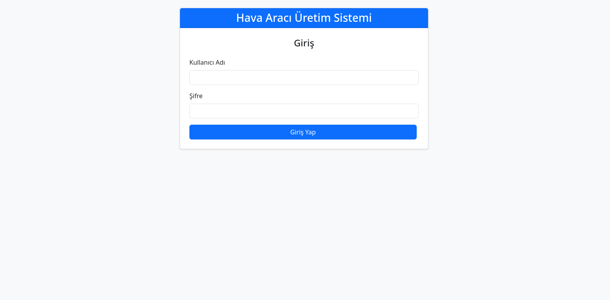

### Takım Üyeleri Listeleme
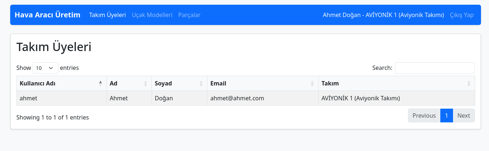

### Uçak Modelleri Listeleme
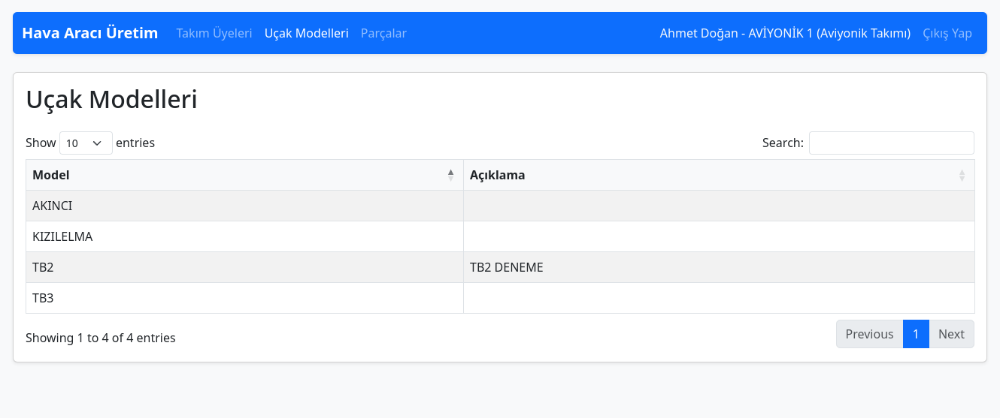

### Parça Yönetimi
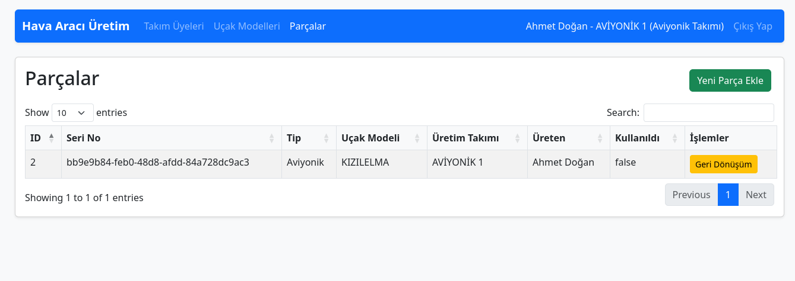

### Parça Ekleme
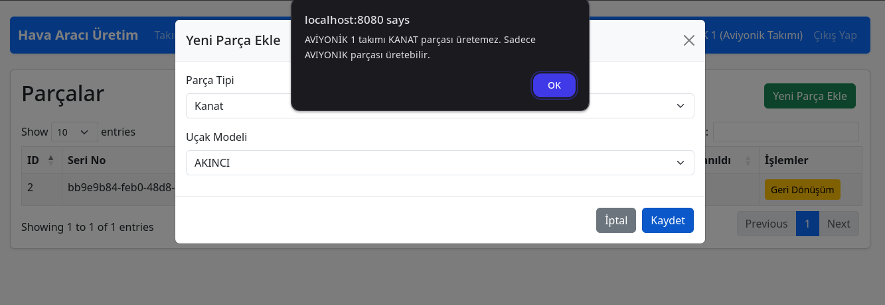

### Uçak Montaj
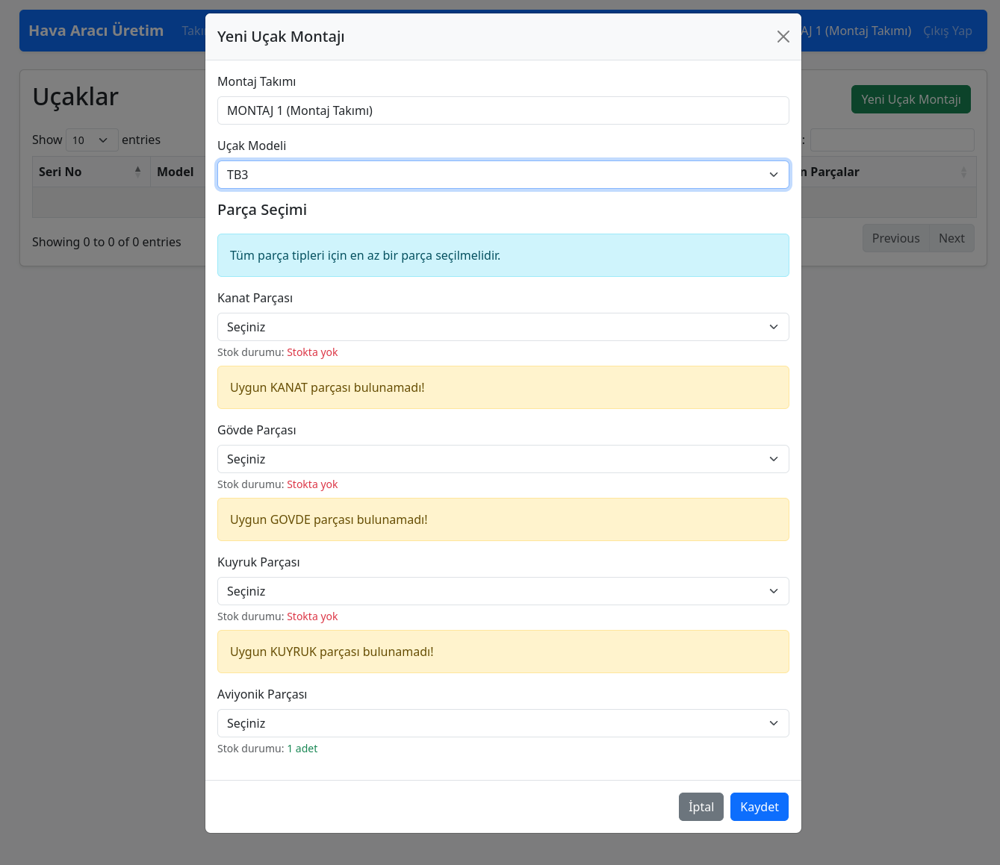

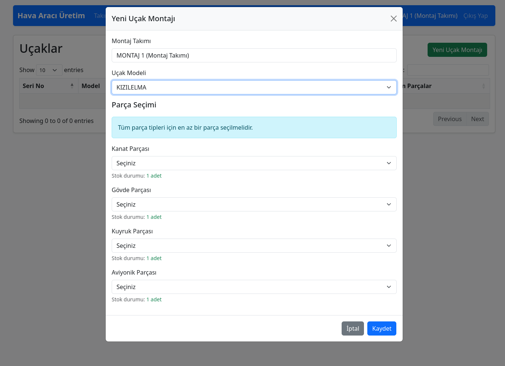

### Uçak Montaj Parça Detayı
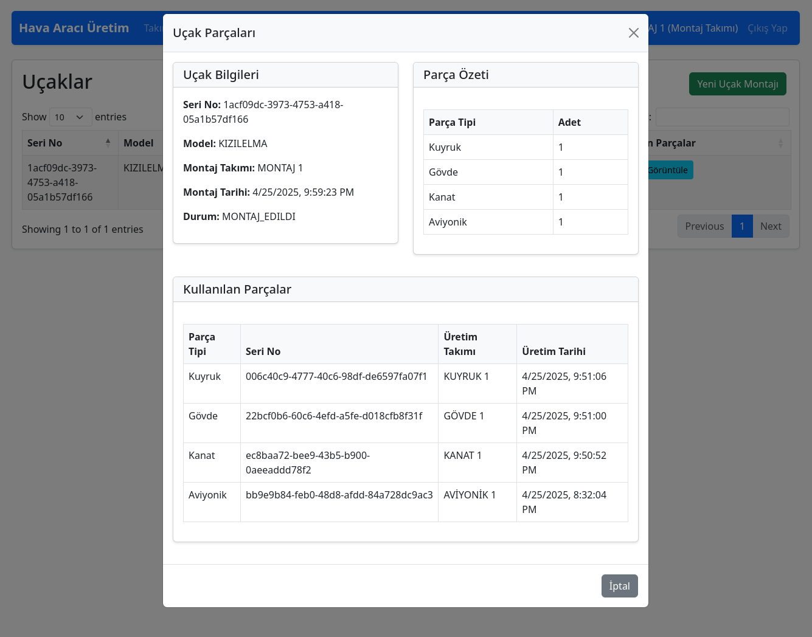

### Admin Takımları Listeleme
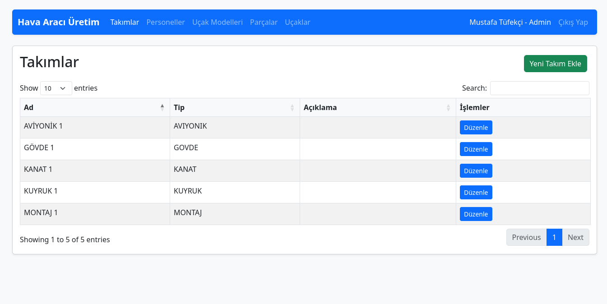

### Admin Personel Listeleme
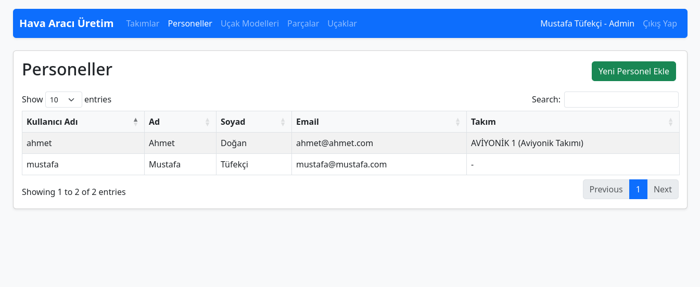

### Admin Personel Ekleme
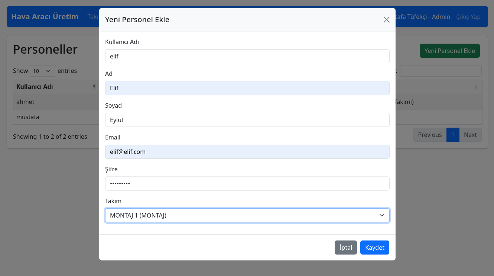

### Admin Uçak Modeli Ekleme
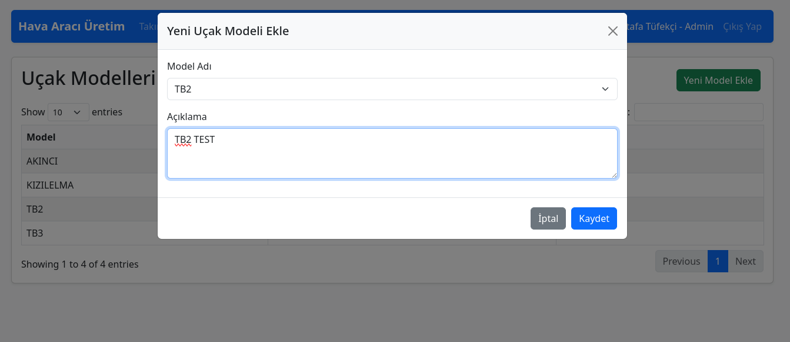

## 📝 API Dokümantasyonu

API dokümantasyonuna Swagger UI üzerinden erişebilirsiniz:
```
http://localhost:8001/swagger
```

Swagger UI üzerinden tüm API endpoint'lerini görüntüleyebilir, test edebilir ve detaylı dokümantasyona erişebilirsiniz.

Temel endpoint'ler:
- `/api/token/` - JWT token alımı
- `/api/takimlar/` - Takım yönetimi
- `/api/personel/` - Personel yönetimi
- `/api/ucak-modelleri/` - Uçak modeli yönetimi
- `/api/parcalar/` - Parça yönetimi
- `/api/ucaklar/` - Uçak yönetimi

## 👥 Kullanıcı Rolleri

1. Admin (Superuser)
   - Tüm sistem yönetimi
   - Takım oluşturma ve yönetimi
   - Personel yönetimi

2. Takım Lideri
   - Kendi takımının yönetimi
   - Parça üretim takibi
   - Montaj süreç yönetimi

3. Takım Üyesi
   - Parça üretimi
   - Montaj işlemleri
   - Stok takibi

## 📊 Veritabanı Şeması

Temel tablolar:
- Users
- Teams
- AircraftModels
- Parts
- Aircrafts
- AssemblyProcesses
